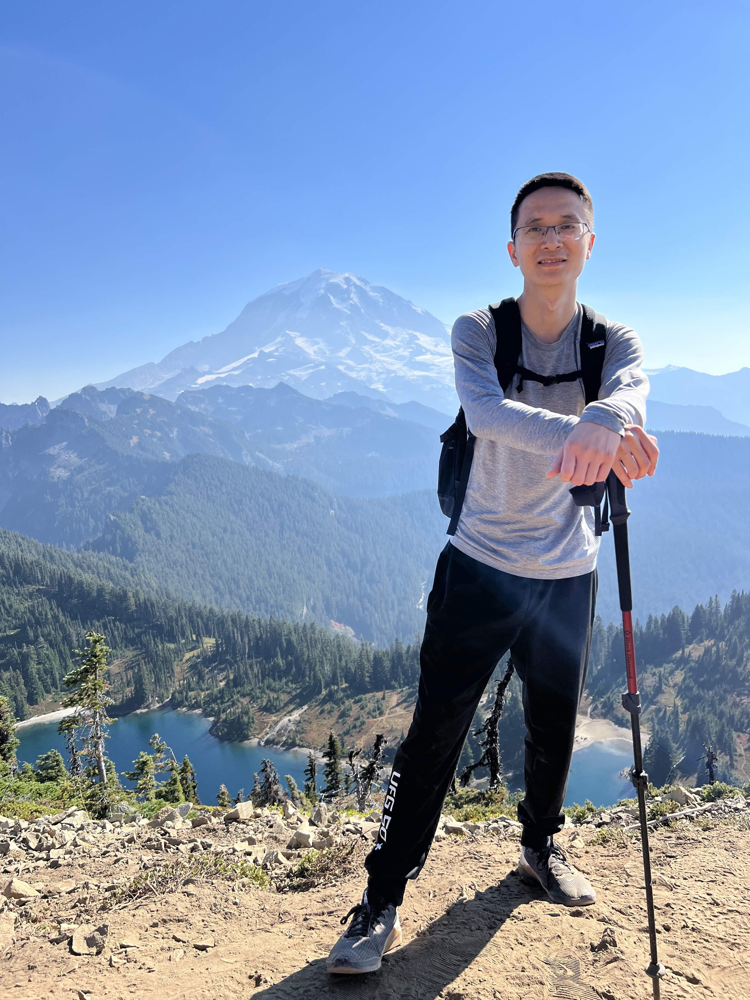

I’m Wei Wen ([温](https://en.wiktionary.org/wiki/%E6%B8%A9)[伟](https://en.wiktionary.org/wiki/%E4%BC%9F)), an AI Research Scientist at Meta. I have been working on LLM (e.g. Llama), on-device GenAI, AI scalability and efficiency, automated generation of AI models, and others. I obtained my Ph.D. degree from Duke University. Before Meta, I work on Automated Machine Learning (AutoML), efficient deep neural networks, and distributed deep learning at [Google Brain](https://ai.google/research/teams/brain) (now part of [Google DeepMind](https://www.deepmind.com/)), [Facebook AI](https://ai.facebook.com/), [Microsoft Research](https://www.microsoft.com/en-us/research/) and [HP Labs](https://www8.hp.com/us/en/hp-labs/index.html).

[GitHub](https://github.com/wenwei202/), [Google Scholar](https://scholar.google.com/citations?user=JYD36ocAAAAJ&hl=en)

# **[Publications](#Publications)**
- **Wei Wen**, Q. Zhu, W. Chu, W.-Y. Chen, and J. Yang. “CubicML: Automated ML for Distributed ML Systems Co-design with ML Prediction of Performance”, Workshop on ML for Systems, *Neural Information Processing Systems* (**NeurIPS**) 2024
- Hua Zheng, Kuang-Hung Liu, Igor Fedorov, Xin Zhang, Wen-Yen Chen, **Wei Wen**, "SiGeo: Sub-One-Shot NAS via Geometry of Loss Landscape", *ACM SIGKDD International Conference on Knowledge Discovery and Data Mining* (**KDD**) 2024. Acceptance Rate: 20%. \[[paper](https://arxiv.org/pdf/2311.13169)\]
- **Wei Wen***, Kuang-Hung Liu*, Igor Fedorov, Xin Zhang, Hang Yin, Weiwei Chu, Kaveh Hassani, Mengying Sun, Jiang Liu, Xu Wang, Lin Jiang, Yuxin Chen, Buyun Zhang, Xi Liu, Dehua Cheng, Zhengxing Chen, Guang Zhao, Fangqiu Han, Jiyan Yang, Yuchen Hao, Liang Xiong, Wen-Yen Chen, “Rankitect: Ranking Architecture Search Battling World-class Engineers at Meta Scale”, *The Web Conference* (**WWW**) 2024. Acceptance Rate: 21.3%. \[[paper](https://arxiv.org/abs/2311.08430)\] 
    - \* equal contributors
- Hang Yin*, Kuang-Hung Liu*, Mengying Sun, Yuxin Chen, Buyun Zhang, Jiang Liu, Vivek Sehgal, Rudresh Rajnikant Panchal, Eugen Hotaj, Xi Liu, Daifeng Guo, Jamey Zhang, Zhou Wang, Shali Jiang, Huayu Li, Zhengxing Chen, Wen-Yen Chen, Jiyan Yang, **Wei Wen** †, “AutoML for Large Capacity Modeling of Meta's Ranking Systems”, *The Web Conference* (**WWW**) 2024. Acceptance Rate: 21.3%. \[[paper](https://arxiv.org/abs/2311.07870)\] 
    - † Project lead
- Tunhou Zhang, Dehua Cheng, Yuchen He, Zhengxing Chen, Xiaoliang Dai, Liang Xiong, Feng Yan, Hai Li, Yiran Chen, **Wei Wen** †, “NASRec: Weight Sharing Neural Architecture Search for Recommender Systems”, *International World Wide Web Conference* (**WWW**) 2023. Acceptance Rate: 365/1900=19.2%. \[[paper](https://arxiv.org/abs/2207.07187)\] 
    - †Corresponding author. Intern Manager
- **Wei Wen**, Yandan Wang, Feng Yan, Cong Xu, Yiran Chen, Hai Li, “SmoothOut: Smoothing Out Sharp Minima to Improve Generalization in Deep Learning”, **preprint**. \[[paper](https://arxiv.org/abs/1805.07898)\]\[[code](https://github.com/wenwei202/smoothout)\]
- **Wei Wen**, Hanxiao Liu, Hai Li, Yiran Chen, Gabriel Bender, Pieter-Jan Kindermans, “Neural Predictor for Neural Architecture Search”, *European Conference on Computer Vision* (**ECCV**) 2020. \[[Video](https://www.youtube.com/watch?v=Pxy3mQ0Hz8M)\]\[[slides](http://www.pittnuts.com/wp-content/uploads/2020/07/long-talk-10-min.pdf)\]\[[paper](http://www.ecva.net/papers/eccv_2020/papers_ECCV/papers/123740647.pdf)\]\[[supplementary](http://www.pittnuts.com/wp-content/uploads/2020/08/6926-supp.pdf)\]
- **Wei Wen**, Feng Yan, Yiran Chen, Hai Li, “AutoGrow: Automatic Layer Growing in Deep Convolutional Networks”, *SIGKDD Conference on Knowledge Discovery and Data Mining* (**KDD**) 2020. Acceptance Rate: 216/1279=16.8%. \[[video](https://www.youtube.com/watch?v=qVfiDmXSPAg)\]\[[slides](http://www.pittnuts.com/wp-content/uploads/2020/06/autogrow-kdd2020.pdf)\]\[[paper](https://arxiv.org/pdf/1906.02909.pdf)\]\[[code](https://github.com/wenwei202/autogrow)\]
- Huanrui Yang, **Wei Wen**, Hai Li, “DeepHoyer: Learning Sparser Neural Network with Differentiable Scale-Invariant Sparsity Measures”, *International Conference on Learning Representations* **(ICLR)** 2020. \[[paper](https://openreview.net/forum?id=rylBK34FDS)\]
- Yuhui Xu, Yuxi Li, Shuai Zhang, **Wei Wen**, Botao Wang, Yingyong Qi, Yiran Chen, Weiyao Lin, Hongkai Xiong. “Trained Rank Pruning for Efficient Deep Neural Networks”, *International Joint Conference on Artificial Intelligence* (**IJCAI**) 2020. \[[paper](https://arxiv.org/abs/1812.02402)\]
- Nathan Inkawhich, **Wei Wen**, Yiran Chen, Hai Li. “Feature Space Perturbations Yield More Transferable Adversarial Examples.” *The Conference on Computer Vision and Pattern Recognition* **(CVPR)** 2019. \[[paper](http://openaccess.thecvf.com/content_CVPR_2019/html/Inkawhich_Feature_Space_Perturbations_Yield_More_Transferable_Adversarial_Examples_CVPR_2019_paper.html)\]
- Sangkug Lym, Esha Choukse, Siavash Zangeneh, **Wei Wen**, Sujay Sanghavi, and Mattan Erez. “PruneTrain: fast neural network training by dynamic sparse model reconfiguration.” *International Conference for High Performance Computing, Networking, Storage and Analysis* **(SC)**. 2019. (**Best Student Paper Finalist, 3.5%)**
- Sangkug Lym, Armand Behroozi, **Wei Wen**, Ge Li, Yongkee Kwon, and Mattan Erez. “Mini-batch Serialization: CNN Training with Inter-layer Data Reuse.” *The Conference on Machine Learning and Systems* (**MLSys**). 2019
- Jingchi Zhang, **Wei Wen**, Michael Deisher, Hsin-Pai Cheng, Hai Li, Yiran Chen, “Learning Efficient Sparse Structures in Speech Recognition”, *International Conference on Acoustics, Speech, and Signal Processing* **(ICASSP)**, 2019. \[[paper](https://ieeexplore.ieee.org/stamp/stamp.jsp?arnumber=8683620)\]
- Xuyang Guo, Yuanjun Huang, Hsin-pai Cheng, Bing Li, **Wei Wen**, Siyuan Ma, Hai Li, Yiran Chen, “Exploration of Automatic Mixed-Precision Search for Deep Neural Networks”, IEEE International Conference on Artificial Intelligence Circuits and Systems (**AICAS**), 2019. (**Best Paper Nomination**)
- **Wei Wen**, Yuxiong He, Samyam Rajbhandari, Minjia Zhang, Wenhan Wang, Fang Liu, Bin Hu, Yiran Chen, Hai Li, “Learning Intrinsic Sparse Structures within Long Short-Term Memory”,*the 6th International Conference on Learning Representations* **(ICLR)**, 2018. \[[poster](https://github.com/wenwei202/iss-rnns/blob/master/Poster_Wen_ICLR2018.pdf)\]\[[paper](https://www.microsoft.com/en-us/research/publication/learning-intrinsic-sparse-structures-within-long-short-term-memory/)\]\[[code](https://github.com/wenwei202/iss-rnns)\]
- Hsin-Pai Cheng, Yuanjun Huang, Xuyang Guo, Feng Yan, Yifei Huang, **Wei Wen**, Hai Li, Yiran Chen, “Differentiable Fine-grained Quantization for Deep Neural Network Compression”, **NeurIPS 2018 CDNNRIA** Workshop . \[[paper](https://openreview.net/pdf?id=ryMdSQZtsX)\]
- **Wei Wen,** Cong Xu, Feng Yan, Chunpeng Wu, Yandan Wang, Yiran Chen, Hai Li, “TernGrad: Ternary Gradients to Reduce Communication in Distributed Deep Learning”,*the 31st Annual Conference on Neural Information Processing Systems* **(NeurIPS)**, 2017. (**O****ral, 40/3240=1.2%. Available in [PyTorch/Caffe2](https://github.com/pytorch/pytorch/blob/0e30fa6f3ccba6c54f4e78583e922d1c5022149d/caffe2/operators/fused_rowwise_random_quantization_ops.cc#L154).**). \[[paper](https://papers.nips.cc/paper/2017/file/89fcd07f20b6785b92134bd6c1d0fa42-Paper.pdf)\]\[[video](https://youtu.be/WWWQXTb_69c?t=20s)\]\[[slides](https://github.com/wenwei202/terngrad/blob/master/NIPS17-TernGrad-slides-v3.pdf)\]\[[code](https://github.com/wenwei202/terngrad)\]\[[poster](https://github.com/wenwei202/terngrad/blob/master/Poster_Wen_NIPS2017.pdf)\]
- **Wei Wen,** Cong Xu, Chunpeng Wu, Yandan Wang, Yiran Chen, Hai Li, “Coordinating Filters for Faster Deep Neural Networks”, *Proceedings of the IEEE International Conference on Computer Vision* **(ICCV)**, 2017. \[[paper](http://openaccess.thecvf.com/content_ICCV_2017/papers/Wen_Coordinating_Filters_for_ICCV_2017_paper.pdf)\]\[[code](https://github.com/wenwei202/caffe/)\]\[[poster](https://github.com/wenwei202/caffe/blob/master/docs/ICCV17-Poster.pdf)\]
- Yandan Wang, **Wei Wen,** Linghao Song, Hai Li, “Classification Accuracy Improvement for Neuromorphic Computing Systems with One-level Precision Synapses “, **ASP-DAC**, 2017. (**Best Paper Award, 2/358=0.56%**). \[[paper](https://arxiv.org/abs/1701.01791)\]
- Chunpeng Wu, **Wei Wen**, Tariq Afzal, Yongmei Zhang, Yiran Chen, Hai Li, “A Compact DNN: Approaching GoogLeNet-Level Accuracy of Classification and Domain Adaptation”, **CVPR**, 2017. \[[paper](http://openaccess.thecvf.com/content_cvpr_2017/papers/Wu_A_Compact_DNN_CVPR_2017_paper.pdf)\]
- Jongsoo Park, Sheng Li, **Wei Wen**, Ping Tak Peter Tang, Hai Li, Yiran Chen, Pradeep Dubey, “Faster CNNs with Direct Sparse Convolutions and Guided Pruning”, *the 5th International Conference on Learning Representations* **(ICLR)**, 2017. \[[paper](https://openreview.net/pdf?id=rJPcZ3txx)\]\[[code](https://github.com/IntelLabs/SkimCaffe)\]\[[media](https://software.intel.com/en-us/articles/scaling-to-meet-the-growing-needs-of-ai)\]
- Yandan Wang, **Wei Wen**, Beiye Liu, Donald Chiarulli, Hai Li, “Group Scissor: Scaling Neuromorphic Computing Design to Big Neural Networks”, *54th ACM/EDAC/IEEE Design Automation Conference* (**DAC**), 2017. Acceptance Rate: 24%. \[[paper](https://arxiv.org/abs/1702.03443)\]
- **Wei Wen,** Chunpeng Wu, Yandan Wang, Yiran Chen, Hai Li, “Learning Structured Sparsity in Deep Neural Networks”, *the 30th Annual Conference on Neural Information Processing Systems* **(NeurIPS)**, 2016. Acceptance Rate: 568/2500=22.7%. ([Integrated into Intel Nervada](https://nervanasystems.github.io/distiller/model_zoo.html#learning-structured-sparsity-in-deep-neural-networks)) \[[paper](http://papers.nips.cc/paper/6504-learning-structured-sparsity-in-deep-neural-networks.pdf)\]\[[code](https://github.com/wenwei202/caffe/tree/scnn)\]\[[poster](https://github.com/wenwei202/caffe/blob/scnn/docs/Poster_Wen_NIPS2016.pdf)\]
- **Wei Wen,** Chunpeng Wu, Yandan Wang, Kent Nixon, Qing Wu, Mark Barnell, Hai Li, Yiran Chen, “A New Learning Method for Inference Accuracy, Core Occupation, and Performance Co-optimization on TrueNorth Chip”, *53rd ACM/EDAC/IEEE Design Automation Conference* (**DAC**), 2016. Acceptance Rate: 152/876=17.4%. (**Best Paper Nomination***, [16/876=1.83%](https://dac.com/content/53rd-dac-best-paperpresentation-nominations)*). \[[paper](http://arxiv.org/abs/1604.00697)\]
- **Wei Wen**, Chi-Ruo Wu, Xiaofang Hu, Beiye Liu, Tsung-Yi Ho, Xin Li, Yiran Chen, “An EDA Framework for Large Scale Hybrid Neuromorphic Computing Systems”, *52nd ACM/EDAC/IEEE Design Automation Conference* (**DAC**), 2015. Acceptance Rate: 162/789=20.5%. (**Best Paper Nomination***, [7/789=0.89%](https://dac.com/content/52nd-dac-best-paper-presentation-nominations)*). \[[paper](http://www.pittnuts.com/wp-content/uploads/2018/10/DAC_2015_PID3646001.pdf)\]
- Jongsoo Park, Sheng R. Li, **Wei Wen**, Hai Li, Yiran Chen, Pradeep Dubey, “Holistic SparseCNN: Forging the Trident of Accuracy, Speed, and Size”, arXiv 1608.01409, 2016. (in [Intel Developer Forum 2016](https://software.intel.com/en-us/articles/scaling-to-meet-the-growing-needs-of-ai), pages 41-43). \[[paper](http://arxiv.org/abs/1608.01409)\]\[[code](https://github.com/IntelLabs/SkimCaffe)\]

# **Industrial Experience**

More in [LinkedIn](https://www.linkedin.com/in/weiwenml/).

- **Google Brain**, Research Scholar, Mountain View, 2019
- **Facebook AI**, Research Intern, Menlo Park, 2018 
- **Microsoft Research**, Research Intern, Bellevue, 2017 
- **HP Labs**, Research Intern, Palo Alto, 2016 
- **Agricultural Bank of China**, Software Engineer, Beijing, 2013-2014
- **Microsoft Research Asia**, Research Intern, Beijing, 2013
- **Tencent Inc.**, Software Engineer Intern, Beijing, 2012

# **Talks and Presentations**

- University of Illinois Urbana-Champaign, Automated Design of Recommender Systems, 04/2024
- Rutgers University, [Rutgers EFficient AI (REFAI) Seminar](https://sites.google.com/site/boyuaneecs/efficient-ai-seminar-talk), [Efficient Deep Learning - on Automated Design, Distributed Training and Edge Inference](https://www.youtube.com/watch?v=0kSo2gJ2wpc), 06/29/2021
- Microsoft Research, Speaker, [Efficient and Scalable Deep Learning](https://www.microsoft.com/en-us/research/video/efficient-and-scalable-deep-learning/), 10/10/2019
- Rice University, Guest Lecture, [ELEC 515 Embedded Machine Learning](http://yl150.web.rice.edu/course2019fall_schedule.html), 10/28/2019.
- UC Berkeley, Scientific Computing and Matrix Computations Seminar, “[On Matrix Sparsification and Quantization for Efficient and Scalable Deep Learning](http://events.berkeley.edu/index.php/calendar/sn/eecs.html?event_ID=120736)“, 10/10/2018
- Cornell University, AI Seminar, “[Efficient and Scalable Deep Learning](https://www.cs.cornell.edu/content/ai-seminar-efficient-and-scalable-deep-learning)“, 10/05/2018
- NIPS 2017 oral presentation, [TernGrad: Ternary Gradients to Reduce Communication in Distributed Deep Learning](https://www.youtube.com/watch?v=WWWQXTb_69c&feature=youtu.be&t=20s), 12/6/2017
- Alibaba DAMO Academy, “[Deep Learning in Cloud-Edge AI Systems](http://www.pittnuts.com/wp-content/uploads/2018/08/Wei-Wen-slides.pdf)“, SunnyVale, CA, 06/28/2018
- “Deep Learning in the Cloud and in the Fog”, \[[Blog](https://mp.weixin.qq.com/s?__biz=MzI5NTIxNTg0OA==&mid=2247490612&idx=3&sn=fc7647a87b7717018a44711647bdfcab&chksm=ec57abb3db2022a5d7d0b7519d07f0b6290f4fe4fe3f7e596cabb67a7bc761900ef58fccf923&mpshare=1&scene=24&srcid=0501buTHWY2VPl72h6znvU0r&key=49e970cd9726b68bc264777a8d3e9712f7c543a0b16e821c2d289a067ae76bd189d904e9aba87e78ec3c36e658a05480f675cba522e13b25a0cfffd4054d4e3872d2fc5f4ccc64bb6e3312521c58e4ae&ascene=0&uin=MjQ5Mzg5NDIyMA%3D%3D&devicetype=iMac+MacBookAir6%2C2+OSX+OSX+10.12.2+build(16C68)&version=12010210&nettype=WIFI&lang=zh_CN&fontScale=100&pass_ticket=McYhrrrjkSZ%2Fnr9pm1ZjPepv6F2XwwyhLMzy2%2BGmpdj7WP6CauPlRdMBzzMOuIOF)@AI科技评论\]
- “Deep Learning in Cloud-Edge AI Systems”, \[[Video](https://pan.baidu.com/s/1o94ShJW) in Mandarin @将门创投\]
- “Lifting Efficiency in Deep Learning – For both Training and Inference”, \[[Video](https://mp.weixin.qq.com/s?__biz=MzA3MzI4MjgzMw==&mid=2650734172&idx=3&sn=82bd7991021c8f748daebd37fb7f2caf&chksm=871b3a22b06cb334a12e387c64d56f98064afe9246138b8792da41f0a3cbb191f18fbbb2b11a&mpshare=1&scene=24&srcid=12086F8xWqU7ggYA0wpfFsEB&key=3994e6ec5ef900e52a85b1f571fa4d1792e8e76896b366fe7ba236fa214838c63b70e3f30a979cb49f83d065e2e1eac2d87521bb0ee3bad62631966613aaa6f146231bb24684475ffafb2cf5381b622e&ascene=0&uin=MjQ5Mzg5NDIyMA%3D%3D&devicetype=iMac+MacBookAir6%2C2+OSX+OSX+10.12.2+build(16C68)&version=12010210&nettype=WIFI&lang=zh_CN&fontScale=100&pass_ticket=nGu6akxICiQth9JIxSfewOBucEJqpoFSHAfsxFMqnd6obBcVDJpWMpnpUgpUpgci) in Mandarin @机器之心\]
- “Scalable Event-driven Neuromorphic Learning Machines 3″, Intel Strategic Research Alliances (ISRA) – UC Berkeley, UC Irvine, Univ of Pitt, UCSD”, 10/27/2016
- “A Predictive Performance Model of Distributed Deep Learning on Heterogeneous Systems”, Final Intern Talk, HP Labs, 08/23/2016
- “Variation-Aware Predictive Performance Model for Distributed Deep Learning”, Summer Intern Fair Poster, HP Labs, 08/02/2016
- “An Overview of Deep Learning Accelerator”, Seminar, HP Labs, 07/18/2016

# **Activities**

- TPC, DAC 2022
- Serving as a reviewer of NeurIPS, ICML, ICLR, CVPR, ICCV, ECCV, TPAMI, IJCV, TNNLS, TCAD, Neurocomputing, TCBB, ICME, TCSVT, etc
- Activity volunteer, Machine Learning for Girls, FEMMES (Female Excelling More in Math, Engineering, and Science) Capstone at Duke University, 02/2018
- Conference volunteer, ESWEEK 2016, OCTOBER 2-7, PITTSBURGH, PA, USA, 10/2016

# **Teaching**

- TA: CEE 690/ECE 590: Introduction to Deep Learning, Duke University, Fall 2018
- TA: STA561/COMPSCI571/ECE682: [Probabilistic Machine Learning](http://www2.stat.duke.edu/~sayan/561/2019/), Duke University, Spring 2019

# **Education**

- **Ph.D.** in Electrical and Computer Engineering, Duke University, 08/2014-12/2019 
    - Advisors: Dr. Hai (Helen) Li and Dr. Yiran Chen
    - First 3 years in University of Pittsburgh, then moved to Duke with my advisors.

- **M.S.** in Electronic and Information Engineering, Beihang University, Beijing, China, 09/2010-01/2013
- **B.S.** in Electronic and Information Engineering, Beihang University, Beijing, China, 09/2006-07/2010

# **Media**

- Duke Electrical and Computer Engineering Ph.D. program cover page, “Q&amp;A: Wei Wen. Making deep learning models faster &amp; more efficient,” accessed on February 14, 2020 at <https://ece.duke.edu/phd/students/wen>.
- People of ACM – Yiran Chen, “One of your most cited recent papers is “[*Learning Structured Sparsity in Deep Neural Networks*](https://proceedings.neurips.cc/paper/2016/file/41bfd20a38bb1b0bec75acf0845530a7-Paper.pdf),” which addresses the importance of enhancing the efficiency of deep neural networks”, accessed on September 24, 2022 at <https://www.acm.org/articles/people-of-acm/2022/yiran-chen>.
